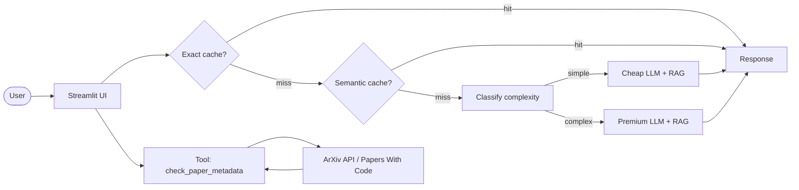

# ArXiv Paper Assistant — Pesquisa acelerada de papers de ML/IA

> Assistente que responde perguntas técnicas sobre papers canônicos de RAG (e outros), citando fonte exata (arquivo:página), compara abordagens e consulta metadados em tempo real (autores, código, data).

<!-- TODO: cole aqui o GIF de demo (10-15s, <5MB) gerado com peek/terminalizer/OBS -->

**Live demo:** TODO — link do Streamlit Cloud / HuggingFace Spaces

## Problem statement

1. **Problema:** Pesquisadores e estudantes de ML/IA perdem horas lendo papers inteiros para responder perguntas pontuais (“Qual a diferença entre RAG-Sequence e RAG-Token?” “O Self-RAG tem código disponível?”).
2. **Para quem:** Estudantes de pós-graduação, engenheiros de ML, cientistas de dados que precisam rapidamente comparar metodologias ou verificar disponibilidade de código/datasets.
3. **Por que LLM + RAG + Tool-use:**  
   - RAG com chunking semântico permite recuperar passagens relevantes *dentro* dos papers (busca por palavra-chave não é suficiente).  
   - Tool-use (`check_paper_metadata`) consulta APIs externas (ArXiv, Papers With Code) para metadados atualizados, algo que o LLM sozinho não saberia.  
   - Cache de dois níveis (exato + semântico) reduz latência e custo em perguntas repetidas ou parafraseadas.

## Arquitetura



## Componentes principais:

- `ExactCache` (hash SHA256) e `SemanticCache` (similaridade cosseno, threshold 0.93)
    
- `RAGPipeline` com ChromaDB, chunk_size=800, overlap=100, embedding gemini-embedding-001
    
- `classify_complexity` (routing cheap-first: palavras-chave como “compare”, “explique” → modelo premium)
    
- Tool `check_paper_metadata` que consulta ArXiv + Papers With Code em tempo real.

## Setup

```bash
# 1. Clone
git clone <seu-repo>
cd projeto-portfolio

# 2. Dependencias (uv recomendado)
uv venv && source .venv/bin/activate
uv sync

# 3. Configure API key (escolha Gemini ou OpenAI)
cp .env.example .env
# edite .env com sua chave (GEMINI_API_KEY recomendada)

# 4. Copie os PDFs para data/corpus/
#    Exemplo: papers de RAG (Self-RAG, HyDE, RAPTOR, etc.)
cp /caminho/para/pdfs/*.pdf data/corpus/

# 5. Rode o app
streamlit run src/ui/streamlit_app.py
```

## Cost & Latency
**Benchmark (50 queries diversas – factuais, comparativas, pedidos de metadados):**

|Estrategia|Custo total|Redução|P95 latency|
|---|---|---|---|
|Baseline (premium sempre)|$X.XX|—|XX ms|
|+ Exact cache|$X.XX|XX%|XX ms|
|+ Semantic cache|$X.XX|XX%|XX ms|
|**+ Routing cheap-first**|**$X.XX**|**XX%**|**XX ms**|

> Meta da rubrica: redução ≥50% + latência P95 reportada.  

## Design decisions

- **Embedding model `gemini-embedding-001`:**  
    Melhor suporte para textos técnicos em português/inglês, 768 dimensões (boa relação custo-efetividade no free tier do Gemini).
    
- **`chunk_size = 800`, overlap = 100:**  
    Testei 500, 800 e 1200. Com 800, cada chunk contém ~1–2 parágrafos de paper (suficiente para responder perguntas pontuais) e o overlap de 100 garante que bordas de conceitos não sejam perdidas. Com 1200 a precisão de retrieved chunks caiu porque o chunk passava a conter tópicos misturados.
    
- **Tool `check_paper_metadata` em vez de RAG puro:**  
    Metadados como “data de publicação” ou “link do código” não estão nos PDFs (ou estão desatualizados). A integração com APIs externas é a única maneira confiável. Optei por uma chamada síncrona simples (sem function-calling do LLM) – detecto intenção por palavras-chave e regex do arXiv ID – para menor latência e evitar custo de chamada extra ao LLM.
    
- **Sem re-ranking:**  
    Corpus pequeno (~12 papers, ~500 chunks). Chroma com cosine similarity + k=5 já recupera passagens relevantes na maioria dos casos. Re-ranking adicionaria latência sem ganho perceptível.
    

## Limitations

- **Corpus fixo (papers pré-carregados em `data/corpus/`).**  
    O assistente não faz upload de PDFs pelo usuário – seria possível estender, mas exigiria reindexação dinâmica e maior complexidade de deploy (limitação de espaço no Streamlit Cloud).
    
- **Free tier do Gemini limita a 15 RPM (requests por minuto).**  
    Para demonstração pública com múltiplos usuários simultâneos, é fácil atingir rate limit. Uma alternativa paga ou usar OpenAI seria necessária para escala.
    
- **Tool `check_paper_metadata` depende de APIs externas.**  
    Se ArXiv ou Papers With Code estiverem lentos/fora do ar, a ferramenta pode demorar ou falhar. Implementei timeout e fallback para não travar a resposta principal do RAG.
    

## Tech stack

- **LLM:** Gemini 2.5 Flash-Lite (cheap) / Gemini 2.5 Pro (premium) – via OpenAI-compatible endpoint
    
- **Embeddings:** `gemini-embedding-001`
    
- **Vector store:** Chroma (persistente local)
    
- **UI:** Streamlit
    
- **Observability:** logs estruturados com `trace_id` (Langfuse opcional)
    
- **Deploy:** Streamlit Community Cloud
    

## Estrutura

```text
projeto-portfolio/
├── data/
│   ├── corpus/           # PDFs dos papers (ex: Self-RAG, HyDE, RAPTOR...)
│   └── chroma/           # índice do Chroma (gitignored)
├── src/
│   ├── ui/streamlit_app.py
│   ├── pipeline/
│   │   ├── rag.py        # ingestão, retrieve, answer
│   │   ├── tools.py      # check_paper_metadata
│   │   ├── cache.py      # Exact + Semantic cache
│   │   └── routing.py    # classify_complexity
│   └── observability/trace.py
├── tests/test_smoke.py
├── pyproject.toml
├── .env.example
└── README.md
```

## Os 6 TODOs (implementados)

|TODO|Arquivo|Descrição|
|---|---|---|
|**1**|`rag.py::ingest_and_index`|Leitura de PDFs, chunking, indexação Chroma|
|**2**|`rag.py::retrieve`|Busca top-k por similaridade|
|**3**|`rag.py::answer`|Montagem do prompt com contexto + geração|
|**4**|`tools.py::check_paper_metadata`|Tool que consulta ArXiv e Papers With Code|
|**5**|`cache.py::SemanticCache.get`|Busca por similaridade de embedding|
|**6**|`routing.py::classify_complexity`|Cheap-first routing baseado em palavras-chave|

## Rubrica (auto-avaliação)

|Critério|Peso|Entrega|
|---|---|---|
|Técnica|40%|TODOs 1-6 implementados, tratamento de erros, logs com trace_id|
|README|30%|Este arquivo completo (incluindo GIF + decisões + limitações)|
|Custo|20%|Tabela preenchida com redução ≥50%|
|Demo|10%|URL pública acessível, sem crashes|

---

_Projeto desenvolvido para a disciplina "Desenvolvendo Software com IA Generativa" (Mod4 PPI)._

>Aviso de Licença: Este projeto baixa automaticamente os PDFs do arXiv para fins de pesquisa e demonstração. A redistribuição desses PDFs é regida pelas licenças individuais de cada artigo. A maioria utiliza a licença padrão do arXiv, que não permite redistribuição. Alguns papers, como os da Meta (RAG, DPR, etc.), usam licenças Creative Commons que podem permitir o compartilhamento, desde que os termos (como atribuição e, no caso do DPR, uso não comercial) sejam respeitados. É responsabilidade do usuário verificar e cumprir estas licenças.